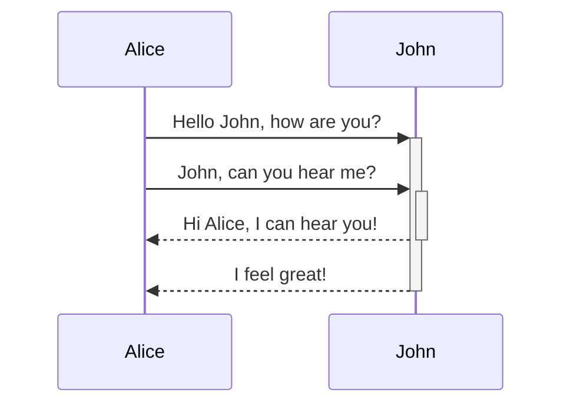
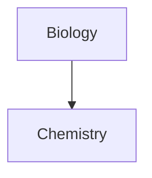

---
tags:
  - recipe
  - cooking
日期:
---
# Obsidian完全指南示例

> 本文档是一份详细的 Obsidian Markdown 语法示例，涵盖了从基础文本格式化到高级元素的绝大多数常用语法。通过阅读和实践，你将能熟练运用 Markdown 进行清晰、高效的写作。[7](@ref)


## 属性(位于文件开头)

```
---
tags:
  - recipe
  - cooking
---
```
类型参考列表目录在：.obsidian/type.json
```
{
  "types": {
    "aliases": "aliases",
    "cssclasses": "multitext",
    "tags": "tags",
    "excalidraw-plugin": "text",
    "excalidraw-export-transparent": "checkbox",
    "excalidraw-mask": "checkbox",
    "excalidraw-export-dark": "checkbox",
    "excalidraw-export-padding": "number",
    "excalidraw-export-pngscale": "number",
    "excalidraw-export-embed-scene": "checkbox",
    "excalidraw-link-prefix": "text",
    "excalidraw-url-prefix": "text",
    "excalidraw-link-brackets": "checkbox",
    "excalidraw-onload-script": "text",
    "excalidraw-linkbutton-opacity": "number",
    "excalidraw-default-mode": "text",
    "excalidraw-font": "text",
    "excalidraw-font-color": "text",
    "excalidraw-border-color": "text",
    "excalidraw-css": "text",
    "excalidraw-autoexport": "text",
    "excalidraw-embeddable-theme": "text",
    "excalidraw-open-md": "checkbox",
    "test": "number",
    "重要性": "checkbox",
    "description": "text",
    "日期": "date",
    "excalidraw-embed-md": "checkbox"
  }
}
```


##  标题 (Headings)

标题是文档的结构骨架。使用 1 到 6 个 `#` 符号来表示 1 到 6 级标题[1,6](@ref)。

# 一级标题 (H1)
## 二级标题 (H2)
### 三级标题 (H3)
#### 四级标题 (H4)
##### 五级标题 (H5)
###### 六级标题 (H6)

**最佳实践：** 在 `#` 和标题文本之间保留一个空格[6](@ref)。

---

## 文本格式 (Text Formatting)

让文本更具表现力。

- **粗体 (Bold)**: 用两个星号 `**` 或下划线 `__` 包裹文本。例如：`**这是粗体**` 显示为 **这是粗体**[2,6](@ref)。
- *斜体 (Italic)*: 用一个星号 `*` 或下划线 `_` 包裹文本。例如：`*这是斜体*` 显示为 *这是斜体*[2,6](@ref)。
- ***粗体与斜体***: 用三个星号 `***` 包裹文本。例如：`***这是粗体与斜体***`[2,7](@ref)。
- ~~删除线 (Strikethrough)~~: 用两个波浪号 `~~` 包裹文本。例如：`~~这是删除线~~` 显示为 ~~这是删除线~~[2,7](@ref)。
- `行内代码 (Inline Code)`: 用反引号 `` ` `` 包裹代码或关键字。例如：`` `print("Hello")` `` 显示为 `print("Hello")`[1,7](@ref)。

---

## 列表 (Lists)

列表用于条理化信息。

### 无序列表 (Unordered List)
使用 `-`、`+` 或 `*` 后跟空格[2,6](@ref)。
- 项目一
- 项目二
  - 嵌套项目 A
  - 嵌套项目 B
- 项目三

### 有序列表 (Ordered List)
使用数字加 `.` 后跟空格[1,2](@ref)。
1. 第一步骤
2. 第二步骤
   3. 子步骤 A
   4. 子步骤 B
5. 第三步骤

### 任务列表 (Task List)
使用 `- [ ]` 表示未完成，`- [x]` 表示已完成[2,7](@ref)。
- [x] 已完成的任务
- [ ] 待办任务一
- [ ] 待办任务二

---

##  链接与图片 (Links & Images)

### 链接 (Links)
- **内联链接**: `[显示文本](https://example.com "可选标题")` 显示为 [示例链接](https://example.com "可选标题")[2,6](@ref)。
- **引用式链接**: 在文中写 `[引用链接示例][1]`，然后在文档末尾定义 `[1]: https://example.com`[2](@ref)。
- **直接URL**: `<https://example.com>` 显示为 <https://example.com>[6](@ref)。
Obsidian 支持以下链接格式：

- 维基链接：
- `[[Three laws of motion]]`
- `[[Three laws of motion.md]]`
- markdown：
- `[Three laws of motion](Three%20laws%20of%20motion)`
  `[Three laws of motion](Three%20laws%20of%20motion.md)`

上述示例是等价的，它们在编辑器中和链接到同一注释中显示相同。
## 使用别名的笔记链接 

Obsidian 创建了带有别名作为自定义显示文本的链接，例如 。`[[Artificial Intelligence|AI]]`
注意
Obsidian 不只是将别名作为链接目的地（），而是使用链接格式以确保与其他使用 Wikilink 格式的应用程序互作。`[[AI]]``[[Artificial Intelligence|AI]]`

### 图片 (Images)
语法与链接相似，但前面加一个 `!`[1,7](@ref)。
``
如果图片无法显示，将展示替代文本[7](@ref)。
嵌入图片：

```md
![[Engelbart.jpg]]
```

你可以通过在链接目标中添加640为宽度，480为高度来更改图片尺寸。`|640x480`

```md
![[Engelbart.jpg|100x145]]
```

如果你只指定宽度，图像会根据原始宽高比进行缩放。例如。`![[Engelbart.jpg|100]]`
你也可以用 markdown 链接嵌入外部托管的图片。你可以像维基链接一样控制宽度和高度。

```md

```
---

## 引用块 (Blockquotes)

使用 `>` 符号表示引用[1,6](@ref)。
> 这是一个引用块。它可以跨越多行。
> 这是引用的第二行。
> 引用块也可以嵌套。
>> 这是嵌套的引用块[6](@ref)。
> **引用块内可以包含其他 Markdown 语法**，例如列表或粗体[6](@ref)。

---

##  代码块 (Code Blocks)

对于多行代码，使用三个反引号包裹[1,4](@ref)。指定语言名称还可实现语法高亮。

#### Python 示例
```python
def greet(name):

"""一个简单的问候函数"""

print(f"Hello, {name}!")

greet("Markdown")
```

#### HTML 示例
```html
<!DOCTYPE html>

<html>

<head>

<title>示例</title>

</head>

<body>

Hello, World!

</body>

</html>
```

---

##  表格 (Tables)

## 表 

你可以用竖条（`|`）分隔列，用连字符（`-`）来定义标题。举个例子：

```md
| First name | Last name |
| ---------- | --------- |
| Max        | Planck    |
| Marie      | Curie     |
```

|名字|姓|
|---|---|
|麦克斯|普 朗 克|
|玛丽|居里|

虽然桌子两侧的竖条是可选的，但建议包含它们以提升阅读性。

在_实时预览_中，你可以右键点击表格来添加或删除列和行。你也可以用上下文菜单进行排序和移动。

您可以使用[命令调色板](https://help.obsidian.md/plugins/command-palette)中的 **“插入表格**  ”命令，或右键点击并选择 _“插入→表_ ”来插入表格。这将给你一个基本且可编辑的表格：

```md
|     |     |
| --- | --- |
|     |     |
```

注意，单元格不需要完美对齐，但头部行必须包含至少两个连字符：

```md
First name | Last name
-- | --
Max | Planck
Marie | Curie
```

### 表格中内容格式化 

你可以用[基本的格式化语法](https://help.obsidian.md/syntax)来为表格中的内容做样式。

|第一列|第二纵队|
|---|---|
|[内部链接](https://help.obsidian.md/links)|链接到你**保险库**_里的文件_ 。|
|[嵌入文件](https://help.obsidian.md/embeds)||

表格中的竖条

如果你想使用[别名](https://help.obsidian.md/aliases) ，或者调整表格中的[图片大小](https://help.obsidian.md/syntax#External%20images) ，你需要在竖条前加一个 `\`。

```md
First column | Second column
-- | --
[[Basic formatting syntax\|Markdown syntax]] | ![[Engelbart.jpg\|200]]
```

|第一列|第二纵队|
|---|---|
|[Markdown 语法](https://help.obsidian.md/syntax)||

通过在标题行添加冒号（`：`）来对齐文本列。你也可以在_实时预览_  中通过上下文菜单对齐内容 。

```md
Left-aligned text | Center-aligned text | Right-aligned text
:-- | :--: | --:
Content | Content | Content
```

|左对齐文本|中间对齐文本|右对齐文本|
|:--|:-:|--:|
|内容|内容|内容|

## 图 

你可以用[美人鱼](https://mermaid-js.github.io/)在笔记中添加图表和图表。美人鱼支持多种图表，如[流程图](https://mermaid.js.org/syntax/flowchart.html) 、 [时序图](https://mermaid.js.org/syntax/sequenceDiagram.html)和[时间线](https://mermaid.js.org/syntax/timeline.html) 。

提示

你也可以试试美人鱼[的实时编辑器](https://mermaid-js.github.io/mermaid-live-editor) ，帮你在写进笔记前先画图。

要添加美人鱼图，可以创建一个`美人鱼`[代码块](https://help.obsidian.md/syntax#Code%20blocks) 。

````md

````

JohnAliceJohnAliceHello John, how are you?John, can you hear me?Hi Alice, I can hear you!I feel great!

````md

````

### 图中文件链接 

你可以通过将`内部链接`[类](https://mermaid.js.org/syntax/flowchart.html#classes)附加到节点上来创建[内部链接](https://help.obsidian.md/links) 。

````md

````

注意


图中的内部链接不会显示在[图视图](https://help.obsidian.md/plugins/graph)中。

如果你的图中节点很多，可以使用以下摘要。

````md

````

这样，每个字母节点都成为内部链接，节点[文本](https://mermaid.js.org/syntax/flowchart.html#a-node-with-text)即为链接文本。

注意

如果你在笔记名中使用特殊字符，就需要用双引号标注笔记名。

```
class "⨳ special character" internal-link
```

或者，`A["⨳ special character"]`.

---

## 分割线 (Horizontal Rules)

使用三个或更多的连字符 `---`、星号 `***` 或下划线 `___` 来创建一条水平分割线[1,6](@ref)。

---

##  高级元素

### 脚注 (Footnotes)
在文中使用 `[^标签]` 添加脚注标记[2](@ref)。
这是一个带有脚注的句子[1](@ref)。这是另一个脚注[2](@ref)。

[1](@ref): 这是第一个脚注的详细说明内容。
[2](@ref): 这是第二个脚注的详细说明内容。

### 数学公式 (LaTeX Math使用mathjax)
部分编辑器支持 LaTeX 数学公式[2,3](@ref)。
- 行内公式： `$E=mc^2$` 显示为 $E=mc^2$。
- 独立公式：
$$
\sum_{i=1}^{n} i = \frac{n(n+1)}{2}
$$

---

## Callouts
> [!info] Here's a callout title
> Here's a callout block.
> It supports **Markdown**, [[Internal link|Wikilinks]], and [[Embed files|embeds]]!
> ![[Engelbart.jpg]]

### 更改标题
> [!tip] Callouts can have custom titles
> Like this one.

### 支持类型
> [!abstract] 抽象
> Lorem ipsum dolor sit amet
别名：`summary` `tldr`

> [!info]
> Lorem ipsum dolor sit amet

> [!todo]
> Lorem ipsum dolor sit amet

> [!tip]
> Lorem ipsum dolor sit amet
别名：`hint` `important`

> [!success]
> Lorem ipsum dolor sit amet
别名：`check` `done`

> [!question]
> Lorem ipsum dolor sit amet
别名：`help` `faq`

> [!failure]
> Lorem ipsum dolor sit amet
别名：`fail``missing`

> [!danger]
> Lorem ipsum dolor sit amet
别名：`error`

> [!bug]
> Lorem ipsum dolor sit amet

> [!example]
> Lorem ipsum dolor sit amet

> [!example]
> Lorem ipsum dolor sit amet


> [!quote]
> Lorem ipsum dolor sit amet
别名：`cite`

### 可折叠
> [!faq]- Are callouts foldable?
> Yes! In a foldable callout, the contents are hidden when the callout is collapsed.

### 嵌套
> [!question] Can callouts be nested?
> > [!todo] Yes!, they can.
> > > [!example]  You can even use multiple layers of nesting.

### 自定义callout
一般在.obsidian/snippets中的css文件中,可以覆盖原有样式
- `--callout-color`使用数字（0–255）定义背景色，代表红、绿、蓝。
- `--callout-icon`可以是 [lucide.dev](https://lucide.dev/) 的图标ID，也可以是SVG元素。
```
.callout[data-callout="custom-question-type"] {
    --callout-color: 0, 0, 0;
    --callout-icon: lucide-alert-circle;
}
```

##  其他技巧

### 转义字符 (Escaping)
如果你需要直接显示 Markdown 的特殊符号（如 `*`、`_`、`#`），请在它前面加上反斜杠 `\`[3,5](@ref)。
例如：`\*这不是斜体\*` 显示为 \*这不是斜体\*。


### 注释 (Comments)
HTML 注释在 Markdown 中不会被渲染[2](@ref)。
<!-- 这是一条注释，在预览模式下不可见。 -->

---
